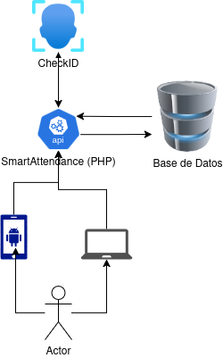

# SmartAttendance 


En este proyecto la idea es que uno pueda enviar una imagen y esta sea verificada en una base de datos para ver si es la misma persona.

## Diagrama de uso


De esta manera el endpoint `index.php` funciona de la siguiente manera 

1. El usuario accede envia la imagen de su rostro y la cédula por la ruta de prueba `views/index.php` (Web) 

2. La API realizara una consulta a la base de datos de donde obtendra el `encode` de la base de datos referente al rostro de esa persona.

3. La imagen que se envio conjunto con el encode obtenido de la base de datos se envian a `CheckID` por medio de la ruta `compare_binary` que recibe dos archivos uno de imágenes y otro que recibe la imagen

4. El resultado de esta API (CheckID) es manejado por SmartAttendance y con esto verifica si es valido para después guardarlo en la base de datos.

## Como levantar los servicios

Este proyecto integra un `docker-compose`que permitira levantar los servicios de `mariadb`, `phpmyadmin` y `checkid` los cuales son indispensables para el buen funcionamiento de SmartAttendance.

| Servicio | Puerto Docker | Puerto Físico | 
|----------|--------|--------|
| MariaDB | 3306 | 3306 |
| PhpMyAdmin | 80 | 8080 |
| MariaDB | 8000 | 5050 |

Los valores por defecto estan establecidos dentro del `docker-compose` de tal manera que se pueda modificar de ser necesario.

---
`Levantar los servicios`
---

Para iniciar todo tenemos que tener instalado `docker` y `docker-compose` una vez que los tengamos instalados vamos a ejecutar:

```bash
# En el directorio donde este nuestro docker-compose.yml
docker-compose up -d
```

Esto instalara automaticamente las imágenes y tambien las ejecutara en segundo plano. Este archivo de configuración permite que los servicios se inicien de manera automática incluso si se reinicio el servidor.

---
`Bajar los servicios`
---

En caso de que sea necesario bajar los servicios de docker ejecutamos: 

```bash
docker-compose down 
```

## Configuración de MySQL

Para configurar nuestra conexión a la base de datos tenemos que ir al directorio `database/` y al archivo `connect.php` donde encontraremos una clase que realiza la conexión a la base de datos.

```php
<?php
class database {
    public $conn;

    public function __construct() {
        // Init the connection
        $this->conn = mysqli_connect(
            "127.0.0.1", // IP de la base de datos 
            "root", // Usuario
            getenv("DB_PASSWORD"), // La contraseña 
            "bd_asistencia2025",  // La base de datos que se desea ingresar
            3306 // Puerto de la base de datos
        );
        mysqli_set_charset($this->conn, 'utf8');

        if(!$this->conn){
            echo "Error". mysqli_connect_error();
        }
    }
}
?>
```

